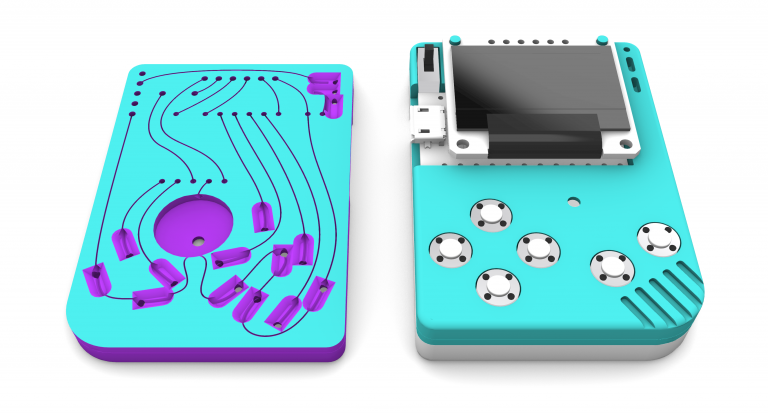

# 3DPCBoy - Build your own handheld gaming platform

This is the OG branch with round switches and flat piezo speaker. The master branch is using more common components.

This repository contains the 3D models for the 3DPCBoy project:
https://vonkonow.com/wordpress/2020/01/3dpcboy-build-your-own-handheld-gaming-platform/

Description:
The 3DPCBoy is a project I have been working on during my spare time for a couple of months. It originated as a test to see how a 3D printer can replace the need for a PCB and over tons of iterations, it has evolved to the 3DPCBoy – a cute handheld Arduboy compatible gaming device that cost around $10, is easy to build and fun to play with.

I think it is a great educational project since it involves several different areas:
*3D printing
*Soldering
*Electronics (microprocessor, display, switches)
*Programming
*Gaming

This project is standing on the shoulders of giants and I want to give credit to Arduino, Arduboy and its game development community. There are over 100 different games to download for free and you can modify them or even develop your own games.

For detailed building instructions visit this page:
https://vonkonow.com/wordpress/2020/01/3dpcboy-build-your-own-handheld-gaming-platform/
